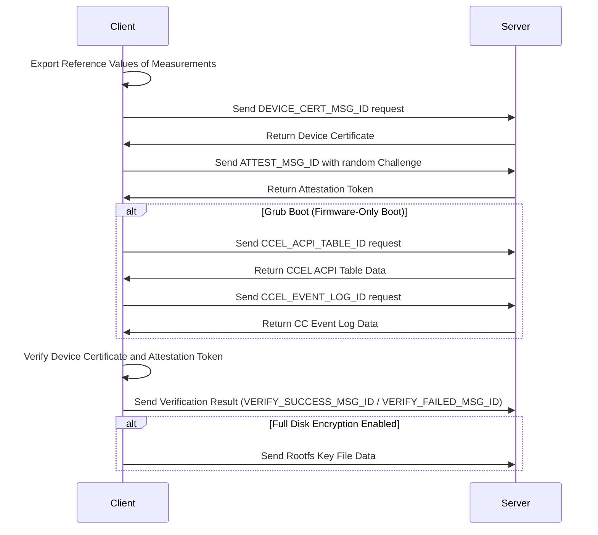
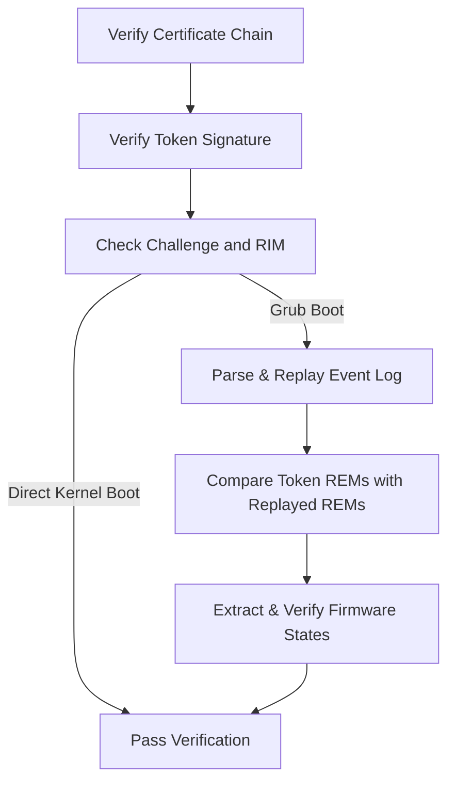

Based on the analysis of measurement and attestation techniques, we propose a solution to establish trust for confidential VMs (CVMs) booting via firmware (aka grub boot). The measured boot follows the [UEFI specification for confidential computing](https://uefi.org/specs/UEFI/2.10/38_Confidential_Computing.html#), details please refer to my previous article. Next, We developed a software development kit (SDK) and open-sourced it in the [openEuler/virtCCA_sdk](https://gitee.com/openeuler/virtCCA_sdk). It provides a suite of tools and libraries to enable remote attestation for grub boot. Today, we'll take a deep dive into this SDK.

## Overview of attestation case

We provices a simple demo [attestation/samples](https://gitee.com/openeuler/virtCCA_sdk/tree/master/attestation/samples) to showcase virtCCA attestation, consisting of a client and a server. The server runs inside the CVM, while the client runs locally (e.g., on a user machine). The client simulates a user with a local verifier and key management. The server uses the [attestation/sdk](https://gitee.com/openeuler/virtCCA_sdk/tree/master/attestation/sdk) to get the device certificate and attestation report (aka attestation token), while the client parses and verifies them. If a CVM boots via grub boot, the server also collects event logs to support attestation. The server and client communicate over TCP. Another demo featuring TLS transmission is available in [attestation/rats-tls](https://gitee.com/openeuler/virtCCA_sdk/tree/master/attestation/rats-tls). _Please note that these demos are for reference only._

Below outlines the interaction between the client and the server:



From the client's perspective, the above process can be broken down into:

- At first of all, you need to set reference values of measurements.

- Obtain the device certificate to represent the identity of a CVM.

- Obtain the attestation token signed by attestation key, it will include a challeng sent by you.

- If grub boot is enabled, the confidential computing event log (CCEL) ACPI table and CCEL data is also required.

- Verify the device certificate and attestation token with the support of endorsements and reference values.

- If full disk encryption (FDE) is enabled, the key file of root file system (rootfs) is delivered upon successful verification.

**Example Commands**

- Run attestation samples for grub boot:

```shell
# Run server inside the CVM
./server -i 127.0.0.1 -p 12345

# Run client locally like user machine
./client -i 127.0.0.1 -p 12345 \
         -m 38d644db0aeddedbf9e11a50dd56fb2d0c663f664d63ad62762490da41562108 \
         -f image_reference_measurement.json
```

## How to generate reference measurements?

we provide two tools to calculate reference valued of measurements, corresponding to the parameters specified with `-m` and `-f` in the example command. The parameter following `-m` represents the reference value for the CVM's initial measurement, calculated using the [gen_rim_ref](https://gitee.com/openeuler/virtCCA_sdk/tree/master/attestation/rim_ref) tool. The JSON file specified with `-f` contains reference measurements of the CVM image, including the grub binary, grub configuration, kernels, and corresponding initramfs images. This file is generated by the [cvm-image-rewriter](https://gitee.com/openeuler/virtCCA_sdk/tree/master/cvm-image-rewriter) tool.

### Reference value of CVM initial measurement

The tool `gen_rim_ref` is similar to [cca-realm-measurements](https://github.com/veraison/cca-realm-measurements). Given a VM configuration (e.g., number of vcpu) and the payload (e.g., firmware binary) to run in the CVM, this tool calculates the CVM Initial Measurements needed for attestation.

### Reference values of CVM image

The `cvm-image-rewriter` tool is used to create, customize and/or measure theCVM image (.qcow2) to support grub boot and attestation. it computes the SHA-256 hashes of components in CVM image, such as grub binary (BOOTAA64.EFI), grub configuration (grub.cfg), kernels and corresponding initramfs images. These hashes are saved in a JSON file (image_reference_measurement.json), and will be used as reference measurements in attestation.

Tp be more specific, this tool mounts the CVM image using `guestmount`, then measures its boot components.

- Grub image and Configuration Measurements:

It compiles a C program (measure_pe.c) to create the MeasurePe binary used to calculate the SHA-256 hash of the GRUB EFI binary (BOOTAA64.EFI). It also computes the SHA-256 hash for the GRUB configuration file.

- Kernel and Initramfs image Measurements:

This function scans the `/boot` directory within the mounted image for kernel images (excluding rescue kernels).

For each found kernel (named vmlinuz-\*), it attempts to uncompress the image, calculates its SHA-256 hash, and then measures the corresponding initramfs image.

These measurements are aggregated into a JSON file named image_reference_measurement.json with the following structure:

```json
{
    "grub": "<GRUB EFI hash>",
    "grub.cfg": "<GRUB config hash>",
    "kernels": [
        {
            "version": "<kernel version>",
            "kernel": "<kernel hash>",
            "initramfs": "<initramfs hash>"
        },
        ...
    ],
    "hash_alg": "sha-256"
}
```

This JSON file will be used in attestation, serving as reference measurements of the CVM image.

## How to verify attestation token?

The detailed process for "Verify Device Certificate and Attestation Token" is shown as follows.



In this process, the device certificate is verified using the root and subordinate certificates. The integrity of the attestation token is then validated against the device certificate. For grub boot, the following steps are done with the support of event logs and reference values of measurements. Please refer to `verify_token` function in [client.c](https://gitee.com/openeuler/virtCCA_sdk/blob/master/attestation/samples/src/client.c) to see detailed codes.

<!-- <script>
  mermaid.initialize({ startOnLoad: true });
</script> -->
